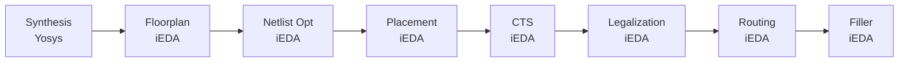

# 使用 Python API 的 GCD 示例

## 安装

请确保已按 **[README](../../../README.cn.md#安装所有依赖)** 中的说明安装所有依赖。

## 使用示例

完整示例代码见：**[ics55flow.py](ics55flow.py)**。

我们可以直接运行示例：

```bash
python docs/examples/gcd/ics55flow.py
```

## 详细解释

开始之前，我们需要先设置工作空间。下面的代码片段展示了如何使用 [ICS55 PDK](https://github.com/openecos-projects/icsprout55-pdk) 为 GCD 示例生成参数：

```python
from chipcompiler.data import get_pdk
from benchmark import get_parameters

# 设置路径
workspace_dir = "./gcd_workspace"
input_verilog = "./docs/examples/gcd/gcd.v"

# 加载 PDK 和设计参数
# 在执行 git submodule update --init --recursive 后会自动下载 ICS55 PDK
pdk = get_pdk("ics55")
parameters = get_parameters("ics55", "gcd")
```

使用下面的 Python 代码生成工作空间：

```python
from chipcompiler.data import create_workspace, get_pdk, StepEnum, StateEnum
workspace = create_workspace(
    directory=workspace_dir,
    origin_def="",
    origin_verilog=input_verilog,
    pdk=pdk,
    parameters=parameters
)
# 使用 `load_workspace` 从已有工作空间恢复
# workspace = load_workspace(directory=workspace_dir)
```

工作空间将从零开始创建，结构如下：

```
gcd_workspace/
├── flow.json       # 流程状态文件
├── parameters.json # 设计参数文件
├── CTS_iEDA        # CTS 步骤工作空间
│   ├── analysis    # 从指标数据中提取的分析数据文件
│   ├── config      # 配置文件
│   ├── data        # 步骤生成的数据文件
│   ├── feature     # 指标数据特征文件
│   ├── log         # 各步骤日志文件
│   ├── output      # 输出产物
│   ├── report      # 步骤生成的报告
│   └── script      # 步骤脚本
├── drc_iEDA
│   ...             # 与上方结构类似，下方亦然
│   └── script
├── filler_iEDA
│   ...
│   └── script
├── fixFanout_iEDA
│   ...
│   └── script
├── Floorplan_iEDA
│   ...
│   └── script
├── legalization_iEDA
│   ...
│   └── script
├── log
│   └── gcd.xxxx-01-22_16-05-25 # 全局日志文件
├── origin
│   ├── gcd.sdc
│   ├── filelist.f
│   └── rtl
├── place_iEDA
│   ...
│   └── script
├── route_iEDA
│   ...
│   └── script
└── Synthesis_yosys
    ...
    └── script
```

然后可以按如下方式设置流程引擎、添加步骤、创建步骤工作空间并运行：

```python
from chipcompiler.data import StepEnum, StateEnum
from chipcompiler.engine import EngineFlow

engine_flow = EngineFlow(workspace=workspace)
if not engine_flow.has_init():
    # 使用 `add_step` 将步骤加入流程
    engine_flow.add_step(step=StepEnum.SYNTHESIS, tool="Yosys", state=StateEnum.Unstart)
    engine_flow.add_step(step=StepEnum.FLOORPLAN, tool="iEDA", state=StateEnum.Unstart)
    engine_flow.add_step(step=StepEnum.NETLIST_OPT, tool="iEDA", state=StateEnum.Unstart)
    engine_flow.add_step(step=StepEnum.PLACEMENT, tool="iEDA", state=StateEnum.Unstart)
    engine_flow.add_step(step=StepEnum.CTS, tool="iEDA", state=StateEnum.Unstart)
    engine_flow.add_step(step=StepEnum.LEGALIZATION, tool="iEDA", state=StateEnum.Unstart)
    engine_flow.add_step(step=StepEnum.ROUTING, tool="iEDA", state=StateEnum.Unstart)
    engine_flow.add_step(step=StepEnum.FILLER, tool="iEDA", state=StateEnum.Unstart)

# 创建步骤工作空间并运行
engine_flow.create_step_workspaces()
engine_flow.run_steps()
```

定义的流程如下：



随后流程引擎会按顺序执行各步骤，你可以在每个步骤工作空间中查看日志和输出结果。
