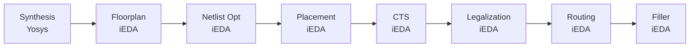

# GCD Examples with Python API

## Installation

Ensure you have installed all dependencies as described in the **[README](../../../README.md#Install-All-Dependencies)**.

## Usage Example

Refer to the complete example script: **[ics55flow.py](ics55flow.py)**.

You can run the example directly:

```bash
python docs/examples/gcd/ics55flow.py
```

## Detailed Explanation

Before we start, we need to set up the workspace. Below is the code snippet to generate parameters for the GCD example using the [ICS55 PDK](https://github.com/openecos-projects/icsprout55-pdk):

```python
from chipcompiler.data import get_pdk
from benchmark import get_parameters

# Setup paths
workspace_dir = "./gcd_workspace"
input_verilog = "./docs/examples/gcd/gcd.v"

# Load PDK and design parameters
# ICS55 PDK will be automatically downloaded after git submodule update --init --recursive
pdk = get_pdk("ics55")
parameters = get_parameters("ics55", "gcd")
```

We use below python code to generate the workspace:

```python
from chipcompiler.data import create_workspace, get_pdk, StepEnum, StateEnum
workspace = create_workspace(
    directory=workspace_dir,
    origin_def="",
    origin_verilog=input_verilog,
    pdk=pdk,
    parameters=parameters
)
# Use `load_workspace` to resume from existing workspace
# workspace = load_workspace(directory=workspace_dir)
```

The workspace will be created from scratch, the structure is as follows:

```
gcd_workspace/
├── flow.json       # Flow state file
├── parameters.json # Design parameters file
├── CTS_iEDA        # CTS step workspace
│   ├── analysis    # Analysis files extract from metrics
│   ├── config      # Configuration files
│   ├── data        # Data files that generated during the step
│   ├── feature     # Metrics feature files
│   ├── log         # Each step log files
│   ├── output      # Output artifacts
│   ├── report      # Reports generated during the step
│   └── script      # Step scripts
├── drc_iEDA
│   ...             # Similar structure as above, same below
│   └── script
├── filler_iEDA
│   ...
│   └── script
├── fixFanout_iEDA
│   ...
│   └── script
├── Floorplan_iEDA
│   ...
│   └── script
├── legalization_iEDA
│   ...
│   └── script
├── log
│   └── gcd.xxxx-01-22_16-05-25 # Global log file
├── origin
│   ├── gcd.sdc
│   ├── filelist.f
│   └── rtl
├── place_iEDA
│   ...
│   └── script
├── route_iEDA
│   ...
│   └── script
└── Synthesis_yosys
    ...
    └── script
```

Then we can set up the flow engine, add steps, create step workspaces, and run the steps as follows:

```python
from chipcompiler.data import StepEnum, StateEnum
from chipcompiler.engine import EngineFlow

engine_flow = EngineFlow(workspace=workspace)
if not engine_flow.has_init():
    # Use `add_step` to add steps to the flow
    engine_flow.add_step(step=StepEnum.SYNTHESIS, tool="Yosys", state=StateEnum.Unstart)
    engine_flow.add_step(step=StepEnum.FLOORPLAN, tool="iEDA", state=StateEnum.Unstart)
    engine_flow.add_step(step=StepEnum.NETLIST_OPT, tool="iEDA", state=StateEnum.Unstart)
    engine_flow.add_step(step=StepEnum.PLACEMENT, tool="iEDA", state=StateEnum.Unstart)
    engine_flow.add_step(step=StepEnum.CTS, tool="iEDA", state=StateEnum.Unstart)
    engine_flow.add_step(step=StepEnum.LEGALIZATION, tool="iEDA", state=StateEnum.Unstart)
    engine_flow.add_step(step=StepEnum.ROUTING, tool="iEDA", state=StateEnum.Unstart)
    engine_flow.add_step(step=StepEnum.FILLER, tool="iEDA", state=StateEnum.Unstart)

# Create step workspaces and run
engine_flow.create_step_workspaces()
engine_flow.run_steps()
```

The flow we defined is:



Then the flow engine will execute the steps sequentially, and you can check the logs and outputs in each step workspace.
