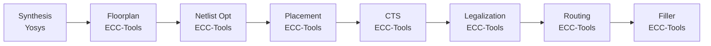

# GCD Examples with Python API

## Installation

Ensure you have installed all dependencies as described in the **[README](../../../README.md#Install-All-Dependencies)**.

## Usage Example

Refer to the complete example script: **[ics55flow.py](ics55flow.py)**.

You can run the example directly:

```bash
python3 docs/examples/gcd/ics55flow.py
```

## Detailed Explanation

Before we start, we need to set up the workspace. Below is the code snippet to generate parameters for the GCD example using the [ICS55 PDK](https://github.com/openecos-projects/icsprout55-pdk):

```python
from chipcompiler.data import get_pdk
from chipcompiler.data import get_design_parameters

# Setup paths
workspace_dir = "./gcd_workspace"
input_verilog = "./docs/examples/gcd/gcd.v"

# Load PDK and design parameters
# ICS55 PDK will be automatically downloaded after git submodule update --init --recursive
pdk = get_pdk("ics55")
parameters = get_design_parameters("ics55", "gcd")
```

We use below python code to generate the workspace:

```python
from chipcompiler.data import create_workspace, get_pdk, StepEnum, StateEnum
workspace = create_workspace(
    directory=workspace_dir,
    origin_def="",
    origin_verilog=input_verilog,
    pdk=pdk,
    parameters=parameters
)
# Use `load_workspace` to resume from existing workspace
# workspace = load_workspace(directory=workspace_dir)
```

The workspace will be created from scratch, the structure is as follows:

```
gcd_workspace/
├── flow.json       # Flow state file
├── parameters.json # Design parameters file
├── CTS_ecc         # CTS step workspace
│   ├── analysis    # Analysis files extract from metrics
│   ├── config      # Configuration files
│   ├── data        # Data files that generated during the step
│   ├── feature     # Metrics feature files
│   ├── log         # Each step log files
│   ├── output      # Output artifacts
│   ├── report      # Reports generated during the step
│   └── script      # Step scripts
├── drc_ecc
│   ...             # Similar structure as above, same below
│   └── script
├── filler_ecc
│   ...
│   └── script
├── fixFanout_ecc
│   ...
│   └── script
├── Floorplan_ecc
│   ...
│   └── script
├── legalization_ecc
│   ...
│   └── script
├── log
│   └── gcd.xxxx-01-22_16-05-25 # Global log file
├── origin
│   ├── gcd.sdc
│   ├── filelist.f
│   └── rtl
├── place_ecc
│   ...
│   └── script
├── route_ecc
│   ...
│   └── script
└── Synthesis_yosys
    ...
    └── script
```

Then we can set up the flow engine, add steps, create step workspaces, and run the steps as follows:

```python
from chipcompiler.data import StepEnum, StateEnum
from chipcompiler.engine import EngineFlow

engine_flow = EngineFlow(workspace=workspace)
if not engine_flow.has_init():
    # Use `add_step` to add steps to the flow
    engine_flow.add_step(step=StepEnum.SYNTHESIS, tool="Yosys", state=StateEnum.Unstart)
    engine_flow.add_step(step=StepEnum.FLOORPLAN, tool="ecc", state=StateEnum.Unstart)
    engine_flow.add_step(step=StepEnum.NETLIST_OPT, tool="ecc", state=StateEnum.Unstart)
    engine_flow.add_step(step=StepEnum.PLACEMENT, tool="ecc", state=StateEnum.Unstart)
    engine_flow.add_step(step=StepEnum.CTS, tool="ecc", state=StateEnum.Unstart)
    engine_flow.add_step(step=StepEnum.LEGALIZATION, tool="ecc", state=StateEnum.Unstart)
    engine_flow.add_step(step=StepEnum.ROUTING, tool="ecc", state=StateEnum.Unstart)
    engine_flow.add_step(step=StepEnum.FILLER, tool="ecc", state=StateEnum.Unstart)

# Create step workspaces and run
engine_flow.create_step_workspaces()
engine_flow.run_steps()
```

The flow we defined is:



Then the flow engine will execute the steps sequentially, and you can check the logs and outputs in each step workspace.

## Using Filelist

Instead of specifying a single RTL file, you can use a **filelist** to specify multiple source files and include directories. This is useful for complex projects with multiple RTL modules.

### Filelist Format

A filelist is a text file (typically with `.f` extension) that specifies multiple RTL source files and include directories for synthesis.

Example `filelist.f`:
```
# RTL source files
rtl/gcd.v
rtl/gcd_pkg.v
rtl/utils.v

# Include directories for Verilog `include directives (.vh header files)
+incdir+rtl/include
+incdir+rtl/common

# Paths with spaces need quotes
"rtl/special modules/module.v"
```

**Supported syntax:**
- **Multiple source files**: List each `.v` file on a separate line
- **Comments**: Use `#` or `//` for full-line or inline comments
- **Include directories**: `+incdir+<path>` - copies all files in these directories to workspace
- **Quoted paths**: Support for paths with spaces: `"path with spaces/file.v"`
- **Relative/absolute paths**: Both are supported
- **Nested structures**: Directory hierarchy is preserved when files are copied to workspace

### Creating a Workspace with Filelist

Use the `input_filelist` parameter when creating a workspace:

```python
from chipcompiler.data import create_workspace, get_pdk
from chipcompiler.data import get_design_parameters

# Setup paths
workspace_dir = "./gcd_workspace_with_filelist"
input_filelist = "./docs/examples/gcd/filelist.f"

# Load PDK and design parameters
pdk = get_pdk("ics55")
parameters = get_design_parameters("ics55", "gcd")

# Create workspace with filelist
workspace = create_workspace(
    directory=workspace_dir,
    origin_def="",
    origin_verilog="",  # Not needed when using filelist
    pdk=pdk,
    parameters=parameters,
    input_filelist=input_filelist  # Provide filelist instead of single file
)
```

When you provide a filelist, the files referenced in the filelist will be processed as follows:
1. **File copying**: All files referenced in the filelist are automatically copied to the workspace
2. **Include directories**: Files in `+incdir+` directories are also copied
3. **Directory structure**: The relative directory structure is preserved
4. **Deduplication**: Files listed in both filelist and `+incdir+` are copied only once

The copied files will be organized in `workspace/origin/` with preserved directory structure:
```
gcd_workspace_with_filelist/
├── origin/
│   ├── filelist.f        # Copied filelist
│   ├── rtl/
│   │   ├── gcd.v
│   │   ├── gcd_pkg.v
│   │   ├── utils.v
│   │   ├── include/      # Files from +incdir+rtl/include
│   │   └── common/       # Files from +incdir+rtl/common
│   ├── gcd.sdc           # Constraint file
│   └── ...
└── ...
```

All files in `+incdir+` directories (typically `.vh` header files) are copied to the workspace, enabling the Verilog synthesis tool to resolve `include statements without path modifications.
