# ECOS Studio User Guide

This guide will walk you through using ECOS Studio to design and implement your chip from RTL to GDS.

## Table of Contents

- [ECOS Studio User Guide](#ecos-studio-user-guide)
  - [Table of Contents](#table-of-contents)
  - [Getting Started](#getting-started)
    - [Launching ECOS Studio](#launching-ecos-studio)
    - [Welcome Screen](#welcome-screen)
  - [Creating a New Workspace](#creating-a-new-workspace)
    - [Step 1: Project Basics](#step-1-project-basics)
    - [Step 2: Design Files](#step-2-design-files)
    - [Step 3: Technology Setup](#step-3-technology-setup)
      - [PDK Selection](#pdk-selection)
      - [Design Parameters](#design-parameters)
    - [Step 4: Review \& Create](#step-4-review--create)
    - [Creating the Workspace](#creating-the-workspace)
  - [Workspace Overview](#workspace-overview)
  - [Workspace Pages](#workspace-pages)
    - [Home Page](#home-page)
    - [Configuration Page](#configuration-page)
    - [Step Editor Pages](#step-editor-pages)
  - [Running RTL-to-GDS Flow](#running-rtl-to-gds-flow)
    - [Starting the Flow](#starting-the-flow)
    - [Monitoring Progress](#monitoring-progress)
  - [Viewing Results](#viewing-results)
    - [Layout Visualization](#layout-visualization)
    - [Indicator Analysis](#indicator-analysis)
  - [Troubleshooting](#troubleshooting)
  - [Next Steps](#next-steps)

---

## Getting Started

### Launching ECOS Studio

**Linux (AppImage):**
```bash
chmod +x ./ECOS-Studio_*.AppImage
./ECOS-Studio_*.AppImage
```

**From Nix:**
```bash
nix shell github:openecos-projects/ecc#ecos-studio
ecc-client
```

### Welcome Screen

When you first launch ECOS Studio, you'll see the welcome screen with options to:
- **New Workspace** - Create a new chip design project
- **Open Workspace** - Open an existing project
- **Recent Projects** - Quick access to recently opened projects

<div align="center">
  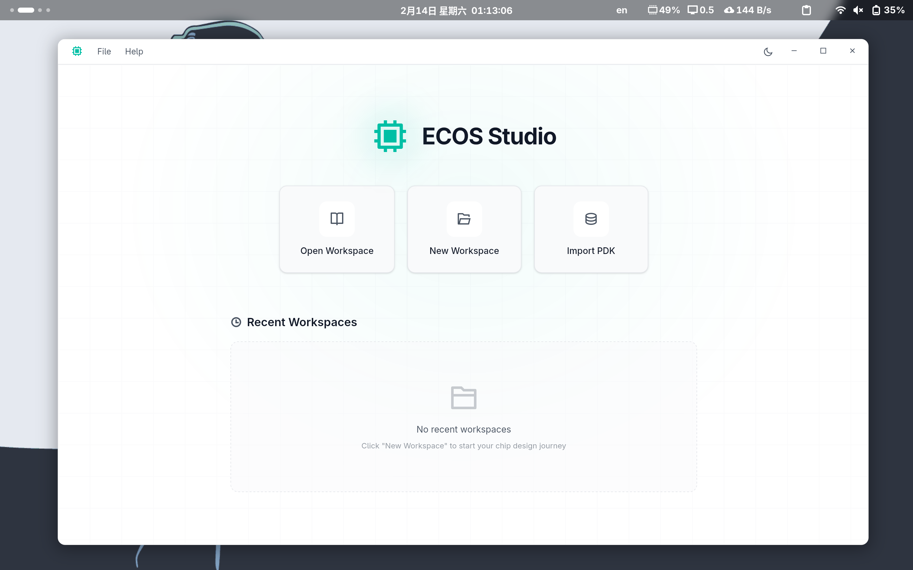
</div>
</br>

---

## Creating a New Workspace

Click **"New Workspace"** to start the project creation wizard. The wizard guides you through 4 steps:

<div align="center">
  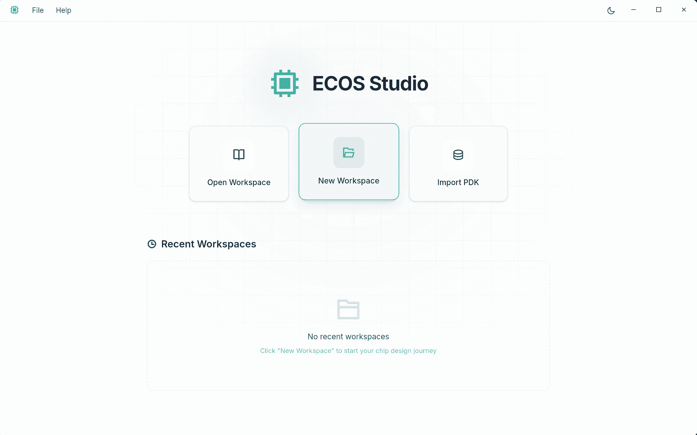
</div>
</br>

### Step 1: Project Basics

Set up your project's fundamental information:

<div align="center">
  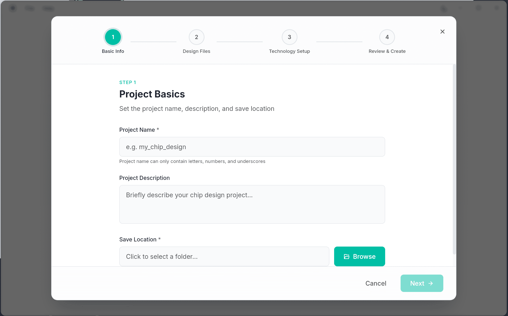
</div>
</br>

**Required Fields:**
- **Project Name** - Unique identifier for your project (letters, numbers, underscores only)
  - Example: `my_chip_design`, `riscv_core`, `dsp_accelerator`
- **Save Location** - Directory where project files will be stored
  - Click **Browse** to select a folder

**Optional Fields:**
- **Project Description** - Brief description of your chip design

**Tips:**
- Choose a descriptive project name that reflects your design
- Select a location with sufficient disk space (recommended: 1GB+)

---

### Step 2: Design Files

Upload your RTL design files:

<div align="center">
  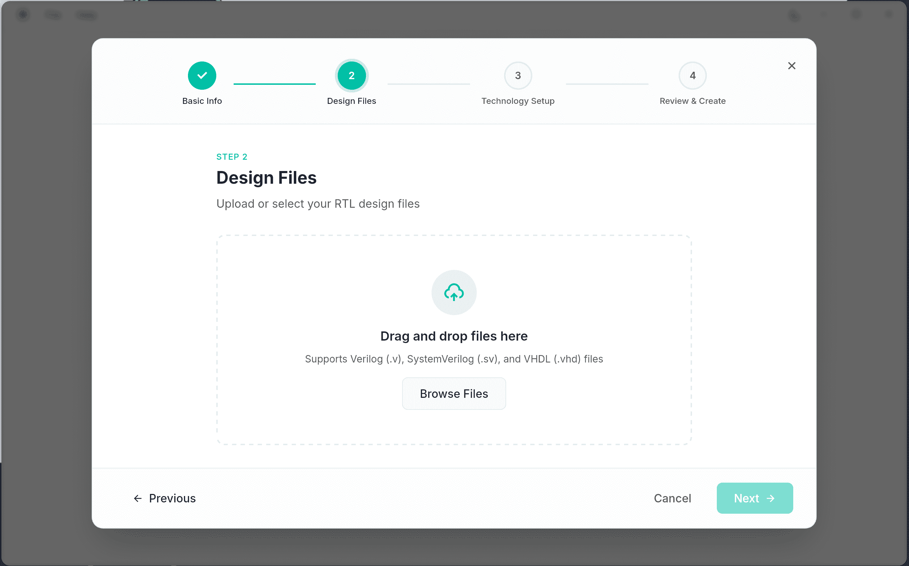
</div>
</br>

**Adding Files:**
- **Drag & Drop** - Drag files directly into the upload zone
- **Browse Files** - Click to select files from your file system

**Supported Formats:**
- Verilog (`.v`)
- SystemVerilog (`.sv`)
- VHDL (`.vhd`)

**Required Information:**
- **Top Module Name** - The top-level module of your design
  - Example: `top`, `chip_top`, `soc_top`
- **Clock Signal Name** - Main clock signal for timing constraints
  - Example: `clk`, `clock`, `sys_clk`

<div align="center">
  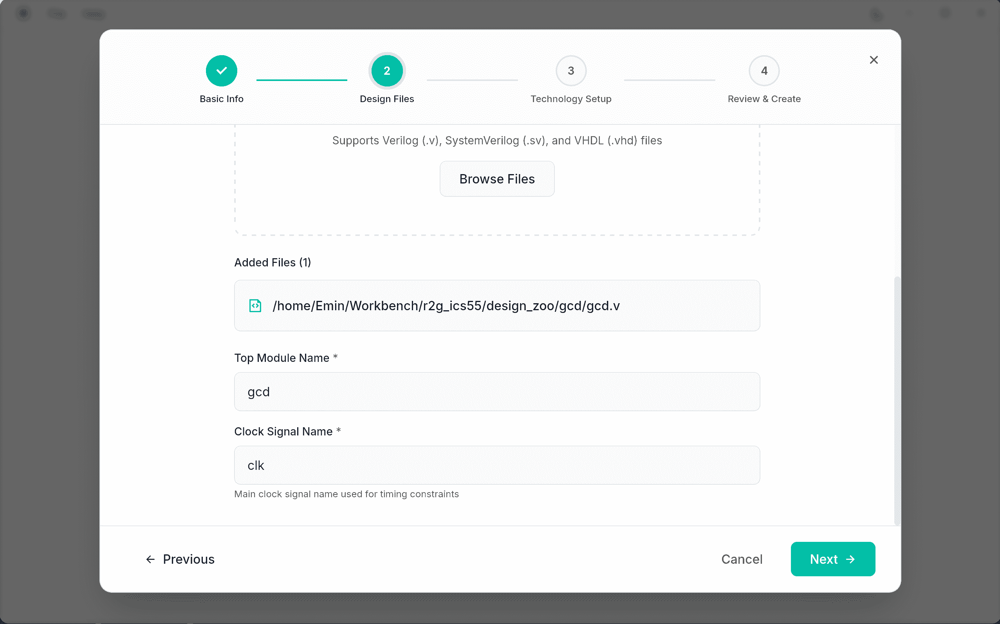
</div>
</br>

**File Management:**
- View all added files in the file list
- Remove files by clicking the delete icon (appears on hover)
- Files are validated for correct format

**Tips:**
- Ensure all dependencies are included
- Verify the top module name matches your RTL
- Use consistent clock naming across your design

---

### Step 3: Technology Setup

Configure process technology and design constraints:

<div align="center">
  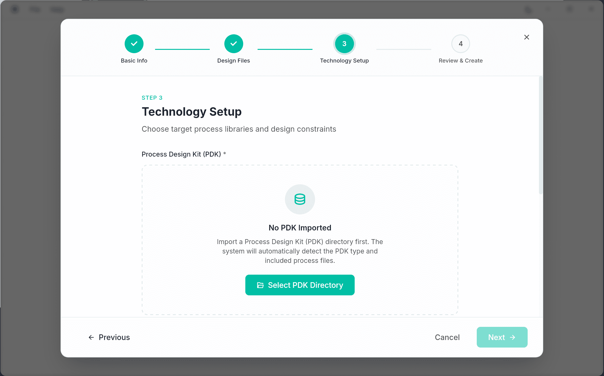
</div>
</br>

#### PDK Selection

**Process Design Kit (PDK)** defines the manufacturing technology:

**Currently Supported:**
- **icsprout55-pdk** - 55nm process technology
  - Open-source PDK
  - Includes standard cell library, I/O cells
  - Suitable for general-purpose digital designs

**Note:** Custom PDK import is not currently supported.

#### Design Parameters

Configure key design specifications:

<div align="center">
  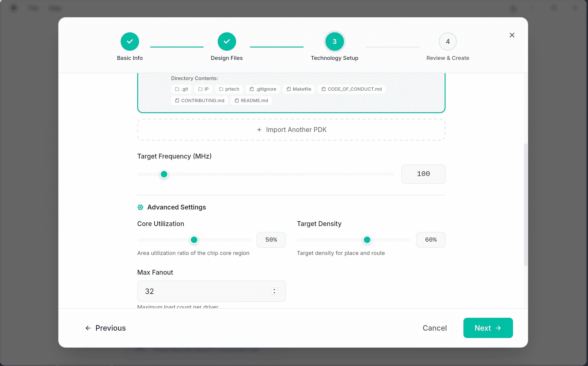
</div>

**Die Size:**
- **Width** - Chip width in micrometers (μm)
- **Height** - Chip height in micrometers (μm)
- Example: 1000 × 1000 μm for a 1mm² chip

**Clock Frequency:**
- Target operating frequency in MHz
- Example: 100 MHz, 500 MHz, 1000 MHz
- Affects timing constraints and optimization

**Cell Libraries:**
- **Buffer Cells** - Cells used for signal buffering
- **Filler Cells** - Cells to fill empty spaces
- **Tie Cells** - Cells for tying signals to VDD/GND

**Tips:**
- Start with conservative die size (can adjust later)
- Set realistic clock frequency based on technology
- Use default cell selections if unsure

---

### Step 4: Review & Create

Review your project configuration before creating the workspace:

<div align="center">
  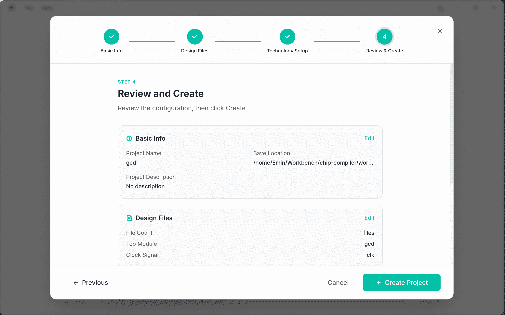
</div>
</br>

**Review Sections:**

**1. Basic Info**
- Project Name
- Save Location
- Project Description
- Click **Edit** to return to Step 1 if changes needed

**2. Design Files**
- List of uploaded RTL files
- Top Module Name
- Clock Signal Name
- Click **Edit** to return to Step 2 if changes needed

**3. Technology Setup**
- Selected PDK (Process Design Kit)
- Die Size (Width × Height)
- Clock Frequency
- Core Utilization
- Target Density
- Max Fanout
- Click **Edit** to return to Step 3 if changes needed

**Tips:**
- Carefully review all settings before creating
- Use Edit buttons to quickly jump back to any step
- All settings can be modified later in project settings

---

### Creating the Workspace

After completing all steps:

1. Review your configuration summary
2. Click **"Create Workspace"**
3. ECOS Studio will:
   - Create project directory structure
   - Copy design files
   - Generate configuration files
   - Initialize workspace database

---

## Workspace Overview

## Workspace Pages

The workspace interface contains multiple pages accessible from the left sidebar navigation:

### Home Page

The Home page provides an overview of your project status and key metrics:

<div align="center">
  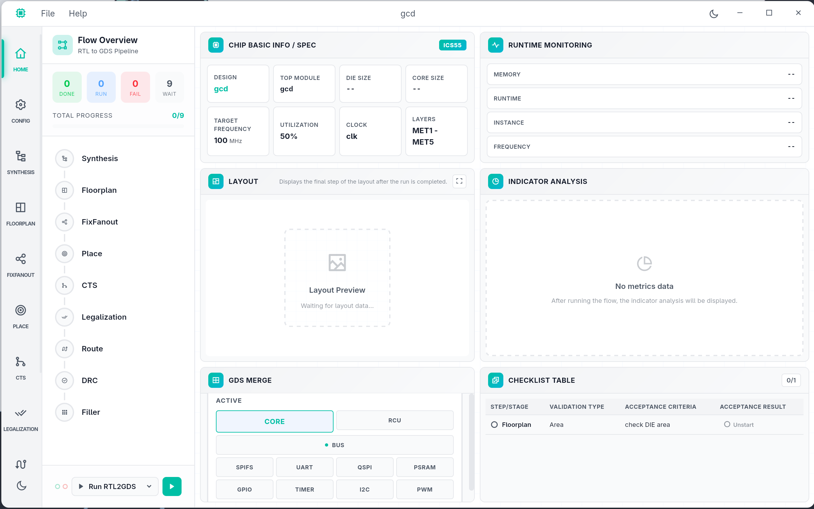
</div>
</br>

**What you'll see:**

**Checklist Table**
- Shows completion status of all flow steps
- ✅ Success / 🔵 Running / ⚪ Pending / ❌ Failed
- Click on any step to view logs

**Runtime monitoring**
- Real-time visualization of flow progress
- Shows memory, runtime, instance, and frequency metrics
- Updates automatically as flow runs

**Layout Preview**
- Visual preview of current layout
- Use mouse wheel to zoom
- Middle-click and drag to pan
- Click fullscreen icon for expanded view

**Indicator Analysis**
- Metric charts from flow execution
- Click any chart for full-screen view
- Shows instance, layer, pin, DRC distributions and CTS skew map

**GDS Merge**
- Final layout merge preview
- Shows complete chip layout

---

### Configuration Page

Modify design parameters and flow settings:

<div align="center">
  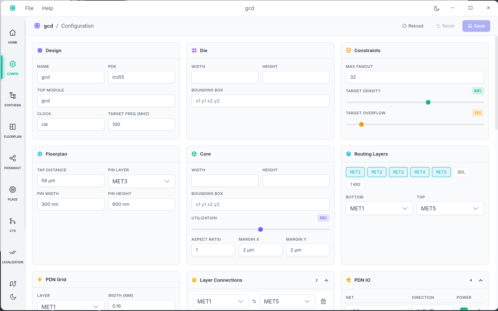
</div>
</br>

**What you can configure:**

**Basic Parameters**
- Design name, top module, clock signal
- Clock frequency target

**Core Settings**
- Die size (width × height)
- Core utilization percentage
- Core margins

**Placement Settings**
- Target density
- Target overflow
- Max fanout

**Floorplan Tracks**
- Routing track specifications
- Add/remove tracks as needed

**PDN (Power Distribution Network)**
- Power/ground pin assignments
- Power stripe specifications
- Layer connections

**How to save changes:**
1. Modify any parameters
2. Click **Save** button
3. Changes marked with * in title bar
4. Click **Reset** to undo unsaved changes

**Note:** Some changes require re-running affected flow steps.

---

### Step Editor Pages

Each flow step (Synthesis, Placement, Routing, etc.) has its own editor page:

<div align="center">
  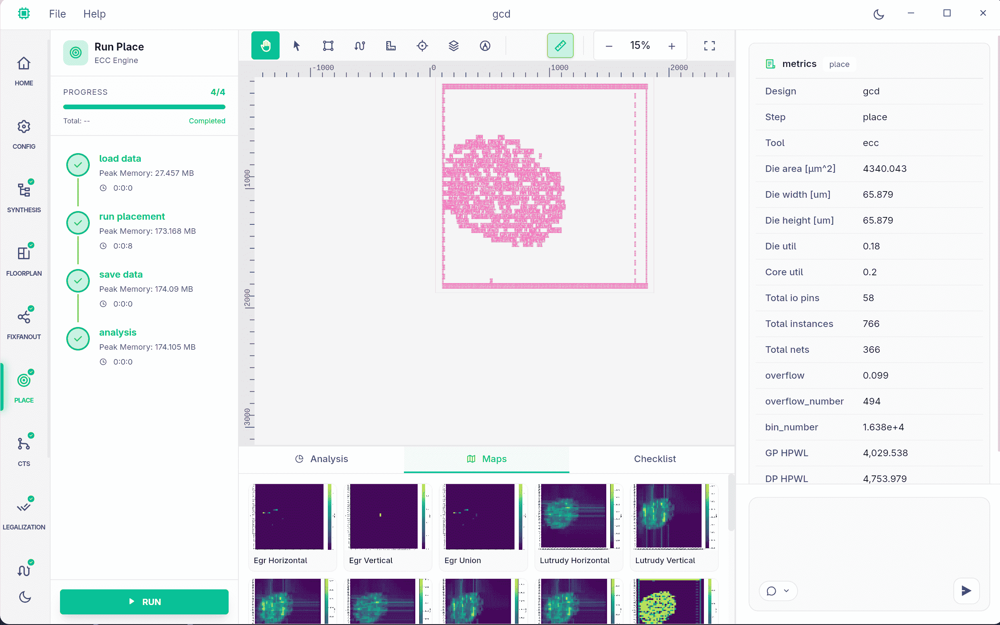
</div>
</br>

**Main Canvas (Left)**
- View and inspect your layout
- Mouse wheel to zoom
- Middle-click and drag to pan
- Left-click to select objects
- Use ruler tool for measurements

**Thumbnail Gallery (Bottom Left)**
- Quick preview of layout snapshots
- Click thumbnail to view that layout state
- Shows layout evolution across steps

**Right Panel**
- **Chat Tab** - Ask questions about your design
- **Inspector Tab** - View selected object properties

---

## Running RTL-to-GDS Flow

### Starting the Flow

Click **"Run"** button in the **Home Page** (Near the RTL2GDS Flow)

<div align="center">
  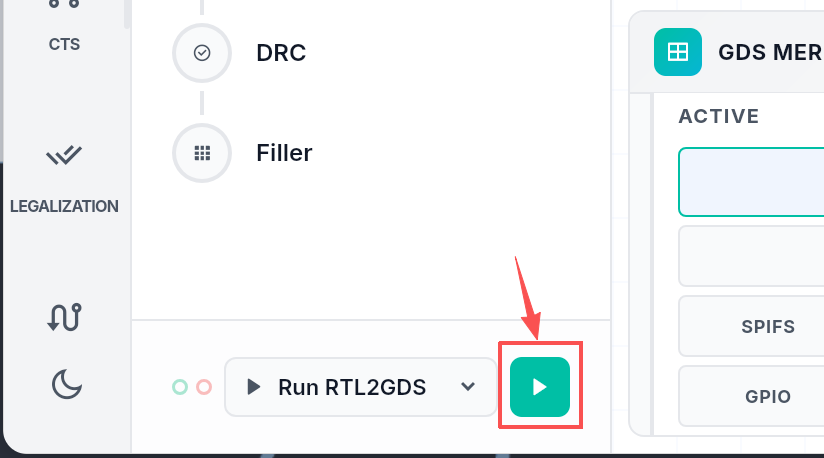
</div>

### Monitoring Progress

<div align="center">
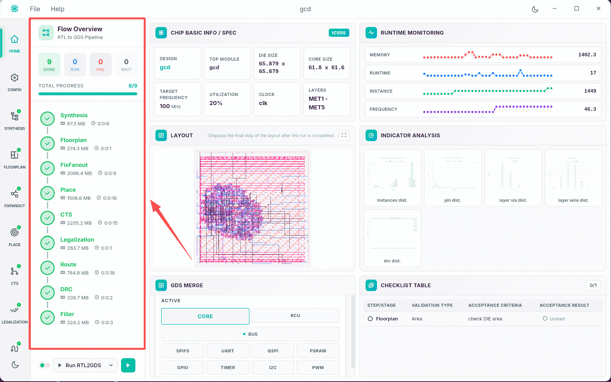
</div>

**Flow Status Indicators:**
- Each step shows real-time status
- Progress bar indicates completion percentage
- Estimated time remaining displayed

**Viewing Logs:**
1. Click on a running/completed step
2. View detailed logs in the left sidebar
3. Filter by log level (Info, Warning, Error)

---

## Viewing Results

### Layout Visualization

**Canvas Controls:**
- **Mouse Wheel** - Zoom in/out
- **Middle Click + Drag** - Pan view
- **Fit to View** - Auto-zoom to fit entire layout
- **Zoom to Selection** - Focus on selected objects

<div align="center">
  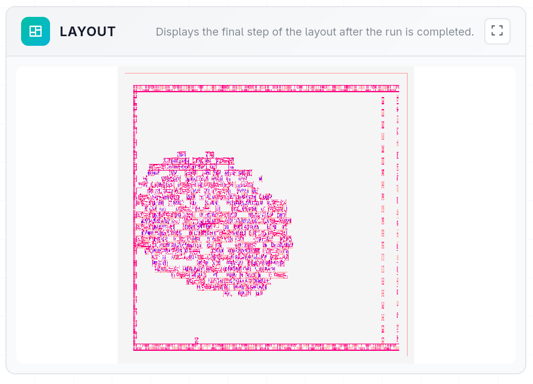
</div>

**Layer Controls:**
- Toggle layer visibility
- Adjust layer colors and transparency
- Common layers:
  - Metal layers (M1, M2, M3, ...)
  - Via layers
  - Cell boundaries
  - Routing blockages

### Indicator Analysis

View design metrics and analysis charts generated during the flow:

<div align="center">
  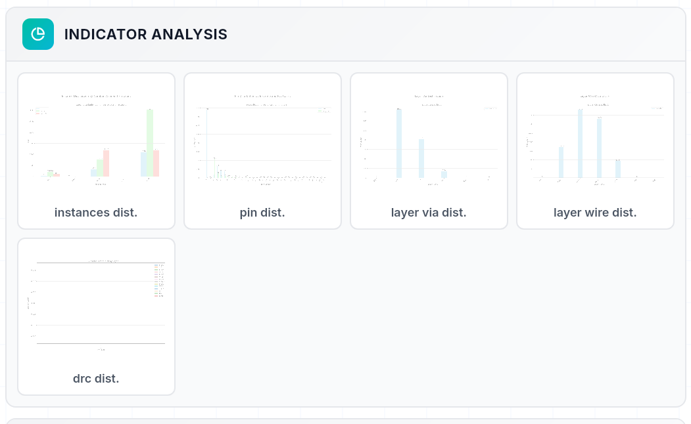
</div>

**Chart Display:**
- Metrics are loaded from flow execution results
- Each chart is clickable for full-screen preview
- Charts are dynamically generated based on flow steps
- Available metrics include:
  - Instance distribution
  - Layer via distribution
  - Layer wire distribution
  - Pin distribution
  - DRC (Design Rule Check) distribution
  - CTS (Clock Tree Synthesis) skew map


---

## Troubleshooting

**Common Issues:**

**Flow Step Failed:**
1. Check logs in left sidebar
2. Look for error messages (red text)
3. Verify input files are correct
4. Check tool-specific requirements

**Performance Issues:**
1. Close unused projects
2. Reduce canvas quality in settings
3. Disable unnecessary layers
4. Check system resources (RAM, CPU)

**Getting Help:**
- Click **Help → Documentation** for detailed guides
- Report bugs or request features: [GitHub Issues](https://github.com/openecos-projects/ecc/issues)
- Ask questions and get support: [GitHub Discussions](https://github.com/openecos-projects/ecc/discussions)

---

## Next Steps

- **Explore Examples** - Check `docs/examples/` for sample projects
- **Read API Guide** - Learn backend integration with REST API
- **Join Community** - Participate in discussions and contribute

For more information, see:
- [Architecture Documentation](architecture.md)
- [Development Guide](development.md)
- [API Guide](api-guide.md)
